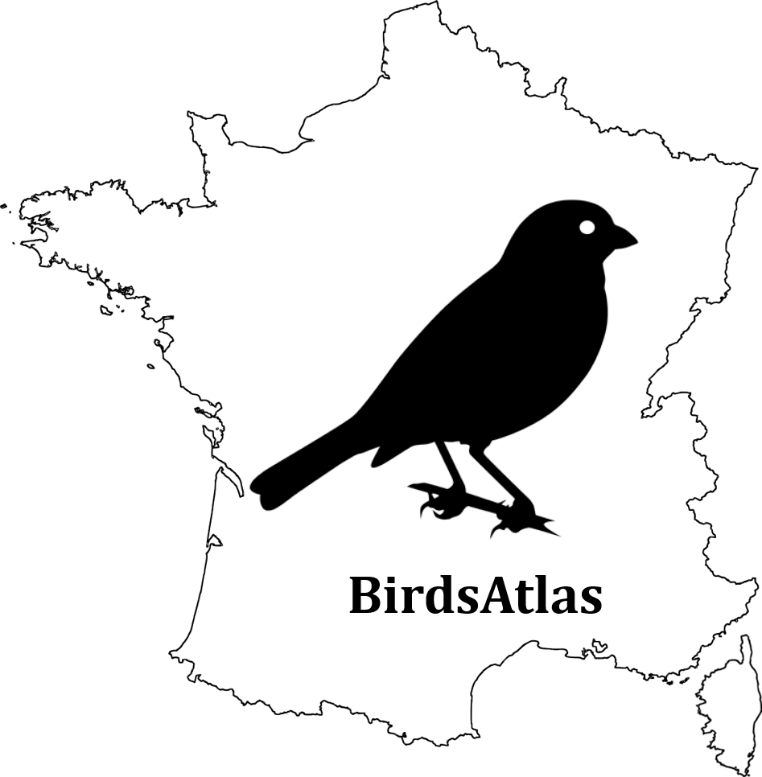

# BirdsAtlas
 

🇬🇧 This site is an aid to fieldwork for the atlas of breeding birds of France ([Oiseaux de France](https://oiseauxdefrance.org/)): it simply combines available data ([Oiseaux de France](https://oiseauxdefrance.org/) and [Cocheurs](https://www.cocheurs.fr/)) in a readable format in order to guide research and improve species knowledge.

Errors are absolutely not excluded (whether of substance or form), do not hesitate to bring this up by creating an [issue](https://github.com/A-d-r-i/birdsatlas/issues).

**Link: [A-d-r-i/BirdsAtlas](https://a-d-r-i.github.io/birdsatlas)**

* * * * *
🇫🇷 Ce site est une aide à la prospection pour l'atlas des oiseaux nicheurs de France ([Oiseaux de France](https://oiseauxdefrance.org/)) : il combine simplement des données disponibles ([Oiseaux de France](https://oiseauxdefrance.org/) et [Cocheurs](https://www.cocheurs.fr/)) en un format lisible afin d'orienter les recherches et améliorer les connaissances des espèces.

Les erreurs ne sont absolument pas exclues (qu'elles soient de fond ou de forme), n'hésitez surtout pas à faire remonter cela en créant une "[issue](https://github.com/A-d-r-i/birdsatlas/issues)".

**Lien : [A-d-r-i/BirdsAtlas](https://a-d-r-i.github.io/birdsatlas)**

